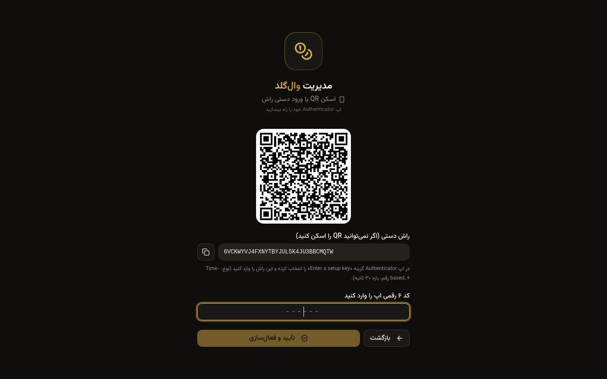
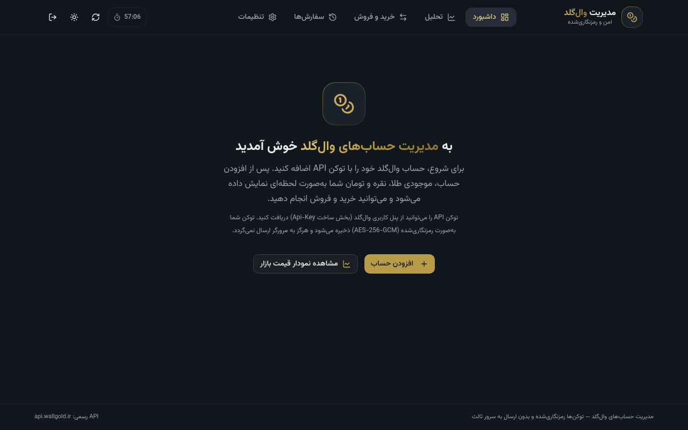
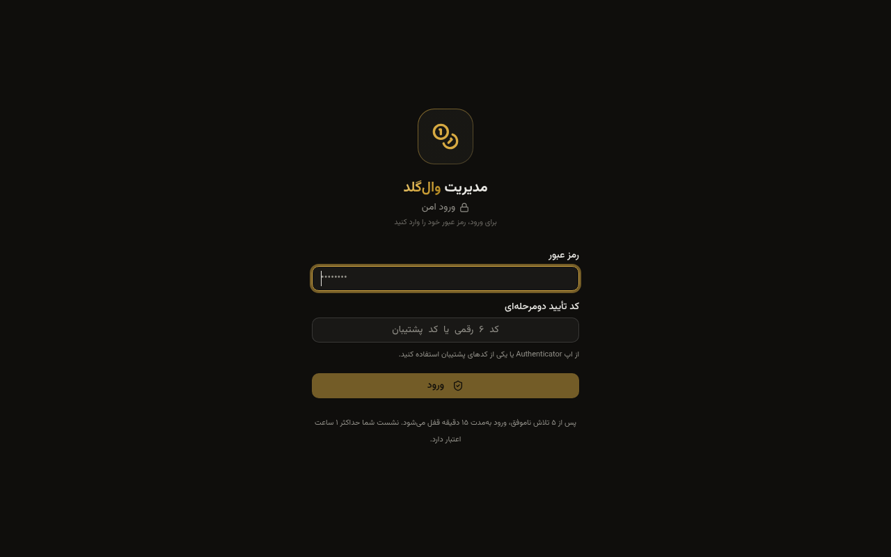
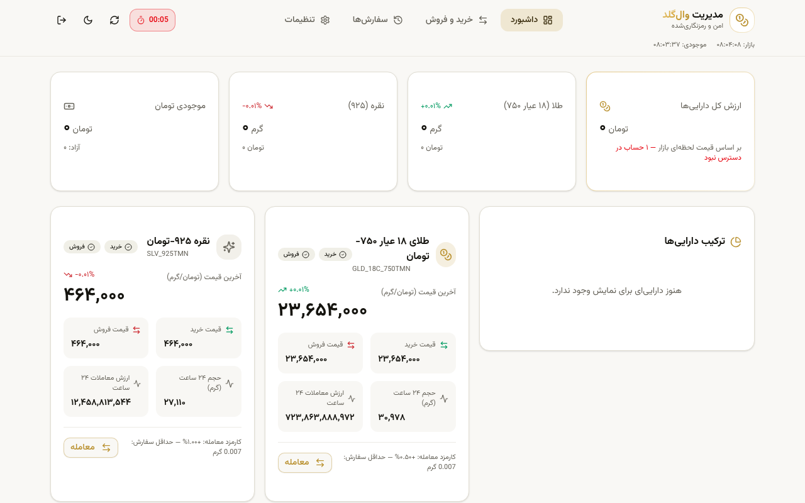
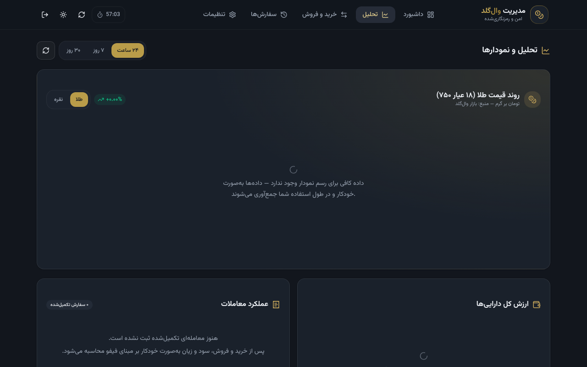
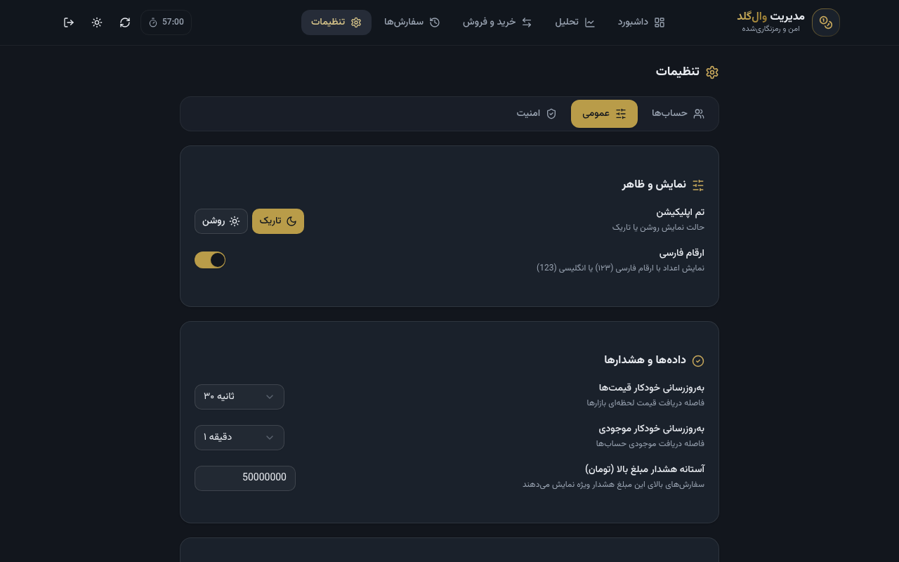

<div align="center">

# 🪙 WallGold Manager — Secure Multi-Account Gold & Silver Trading

**Self-hosted, security-first manager for multiple [WallGold](https://wallgold.ir) accounts — live balances, safe 4-step trading, TOTP two-factor login, and AES-256 encrypted API tokens. Runs entirely on Cloudflare Workers.**

*نسخه فارسی این مستندات [این‌جا](README_FA.md) موجود است.*

[](https://github.com/NarimanKhaleghi/wallgold-management/blob/main/README_FA.md)
[](https://github.com/NarimanKhaleghi/wallgold-management)

---

[](https://github.com/NarimanKhaleghi/wallgold-management/stargazers)
[](https://github.com/NarimanKhaleghi/wallgold-management/forks)
[](https://github.com/NarimanKhaleghi/wallgold-management/commits/main)
[](LICENSE)

[](https://developers.cloudflare.com/workers/)
[](https://developers.cloudflare.com/d1/)
[](https://hono.dev/)
[](https://react.dev/)
[](https://www.typescriptlang.org/)
[](https://tailwindcss.com/)
[](https://vite.dev/)

### 🚀 Deploy to your own Cloudflare account in one click

[](https://deploy.workers.cloudflare.com/?url=https://github.com/NarimanKhaleghi/wallgold-management)

*No servers, no config files to edit, no database to create manually — the D1 database is provisioned and initialized automatically on first run.*

</div>

---

## 📸 Screenshots

| First-run setup & 2FA enrollment | Dashboard & trading |
|:---:|:---:|
|  |  |
| *QR + secret + backup codes* | *Live markets, portfolio, 4-step trade wizard* |

| Login with 2FA | Light theme |
|:---:|:---:|
|  |  |

| Analytics & charts | Settings — organized tabs |
|:---:|:---:|
|  |  |
| *Price history, portfolio value, trade PnL* | *Accounts / General / Security* |

## 🌟 About The Project

**WallGold Manager** gives you a single, private control panel for all your [WallGold](https://wallgold.ir) OTC gold & silver accounts: real-time balances across accounts, a deliberate **4-step confirmation flow** for every buy/sell order (because one-click trading with real money is dangerous), a complete order history, and hard security defaults — password login, **TOTP two-factor authentication**, 1-hour expiring sessions, and API tokens encrypted at rest with **AES-256-GCM**.

Everything runs as a single **Cloudflare Worker** backed by a **D1** SQLite database: sub-100ms cold starts, zero servers to maintain, and your instance is yours alone. Your WallGold API tokens **never reach the browser** — all upstream calls are proxied server-side to `api.wallgold.ir` only. The backend's only runtime dependency is [Hono](https://hono.dev/) — a deliberately minimal supply-chain attack surface.

> ⚠️ **Not financial advice.** This is a tool for managing your own accounts. Trading gold/silver carries risk. Use at your own responsibility.

## 🎯 Key Features

| Feature | Description |
|:--------|:------------|
| 👥 **Multi-account management** | Add unlimited WallGold accounts with personal API tokens; each token is **validated on add**, stored encrypted (AES-256-GCM), and never sent to the browser |
| 📊 **Live dashboard** | Gold (18k/750), silver (925) and TMN balances per account + aggregated totals in toman, free vs. locked amounts, live prices, 24h change/high/low/volume, portfolio allocation pie chart |
| 🛒 **Safe 4-step trading** | Step 1: parameters with live market-limit & balance validation → Step 2: private quote with **30s TTL countdown** (expiry disables submission) → Step 3: full summary, high-value warning, risk-acceptance checkbox, typed confirmation phrase + 5s cooldown → Step 4: submit with unique `clientId` and live status tracking |
| 🔐 **Password + TOTP 2FA** | First run forces you to create a password, then strongly recommends enrolling 2FA — **QR code and manual secret both shown**, compatible with Google/Microsoft Authenticator, Authy, Aegis, 1Password. 8 single-use backup codes |
| ⏱️ **1-hour sessions** | Server-enforced absolute session expiry with live countdown in the header, automatic logout, optional inactivity auto-logout, "log out everywhere" |
| 🛡️ **Hardened by default** | PBKDF2-SHA256 (100k iterations) password hashing, per-IP rate limiting & lockout on login/TOTP, CSRF double-check (custom header + Origin), strict CSP and security headers, `no-store` on all API responses |
| 📜 **Order history** | Local tracked history with filters (account/market/side/status), manual `orderId` tracking for orders placed outside the app, detail refresh from the API |
| 🌗 **Persian RTL UI** | Fully responsive dark/light themes, Vazirmatn font (self-hosted), Persian or English digits, pull-to-refresh on mobile, accessible (ARIA + keyboard) |
| ⚡ **Edge-native** | Single Worker + D1: global low latency, 10s in-memory market cache, parallel balance fetching, no external services |

## 🏗️ Architecture

```
┌──────────────────────────┐            ┌────────────────────────────────┐
│   Browser (RTL React SPA)│   HTTPS    │   Cloudflare Worker (Hono)     │
│   Vite + React 19        │ ─────────► │   ├─ Auth: password + TOTP     │
│   Zustand + Recharts     │  session   │   ├─ Sessions (1h, hashed)     │
│   Login/2FA/Trade wizard │   cookie   │   ├─ Rate limiting (D1)        │
└──────────────────────────┘            │   ├─ Security headers + CSRF   │
                                        │   └─ AES-256-GCM token vault   │
                                        │            │                   │
                                        │      D1 (SQLite) ◄─────────────┤
                                        └────────────┬───────────────────┘
                                                     │ server-side only
                                          ┌──────────▼───────────┐
                                          │  WallGold official API│
                                          │  api.wallgold.ir      │
                                          └──────────────────────┘
```

- **Tokens never touch the browser** — every WallGold call is proxied by the Worker; the SPA only ever talks to its own origin.
- **Session tokens are stored hashed** (SHA-256) — a database leak cannot be replayed as a login.
- **The only outbound connection** the Worker makes is to `api.wallgold.ir`.
- **Schema self-initializes**: tables are created idempotently on first request — no manual SQL steps after deployment.

## 🚀 Deployment (Cloudflare Workers)

### Method 1 — One-click Deploy button *(recommended)*

1. Click the button:

   [](https://deploy.workers.cloudflare.com/?url=https://github.com/NarimanKhaleghi/wallgold-management)

2. Authorize the deploy flow with your Cloudflare account (it clones the repo into a Git-connected Worker).
3. Confirm the build settings when prompted:
   - **Build command:** `npm run build`
   - **Deploy command:** `npx wrangler deploy`
4. The D1 database is provisioned automatically by the flow (binding `DB`). Done — open your `*.workers.dev` URL and the first-run setup wizard appears.

> 💡 The deploy flow provisions the D1 database declared in `wrangler.toml`. If your flow requires an existing database, use Method 3 (CLI) — it takes 2 commands.

### Method 2 — Connect the GitHub repo (CI/CD on every push)

1. In the Cloudflare dashboard: **Workers & Pages → Create → Workers → Import a repository**, pick your fork of `wallgold-management`.
2. Set **Build command** `npm run build` and **Deploy command** `npx wrangler deploy`.
3. Under **Settings → Bindings**, add a **D1 database** binding named `DB` (create `wallgold-management` if it doesn't exist).
4. Save & deploy. Every future `git push` redeploys automatically.

### Method 3 — Wrangler CLI

```bash
git clone https://github.com/NarimanKhaleghi/wallgold-management
cd wallgold-management
npm install

# create the D1 database (once) and put its printed ID into wrangler.toml
npx wrangler d1 create wallgold-management

# build the frontend and deploy the Worker
npm run deploy
```

`npm run deploy` = `vite build` + `wrangler deploy` — the Worker bundles the API, and `dist/` is uploaded as static assets.

### Method 4 — GitHub Actions

A ready-made workflow is included at `.github/workflows/deploy.yml`. Add these two repository secrets and push to `main`:

| Secret | Value |
|---|---|
| `CLOUDFLARE_API_TOKEN` | Token with *Workers Scripts:Edit* + *D1:Edit* permissions |
| `CLOUDFLARE_ACCOUNT_ID` | Your Cloudflare account ID |

### Post-deploy: bind D1 (if needed) & secrets

The app works out of the box — the encryption key is auto-generated and stored inside your private D1 database on first run. For maximum isolation you can provide your own key **before adding any accounts**:

```bash
# generate a 32-byte key
openssl rand -base64 32

# set it as an encrypted secret
npx wrangler secret put ENCRYPTION_KEY
```

If `ENCRYPTION_KEY` is set, it takes precedence over the stored key (accounts added before must be re-added if you switch).

<details>
<summary><b>⚙️ All configuration variables</b></summary>

| Variable / Secret | Default | Description |
|---|---|---|
| `DB` *(D1 binding)* | — | **Required.** D1 database binding |
| `SESSION_TTL_SECONDS` | `3600` | Absolute session lifetime (min 60s). 3600 = 1 hour |
| `PBKDF2_ITERATIONS` | `100000` | Password hashing iterations (min 10000) |
| `ENCRYPTION_KEY` *(secret)* | auto-generated in D1 | 32-byte base64 AES-256-GCM master key for token encryption |

</details>

## 💻 Local Development

```bash
git clone https://github.com/NarimanKhaleghi/wallgold-management
cd wallgold-management
npm install

npm run dev        # starts BOTH: wrangler dev (API+D1 on :8787) and vite (:5173, HMR)
```

Open **http://localhost:5173** — API calls are proxied to the local Worker with a local D1 database (stored under `.wrangler/state`, never committed).

```bash
npm run preview    # production build served by the Worker on :8787
npm run typecheck  # strict TypeScript check
npm run totp -- <SECRET>   # generate a TOTP code from a base32 secret (testing/recovery helper)
```

## 🔌 WallGold API usage

Implements the official [WallGold API v1](https://developers.wallgold.ir/fa/docs):

| Service | Method | Path | Auth |
|---|---|---|---|
| Markets | GET | `/api/v1/markets` | public |
| Balances | GET | `/api/v1/account/balances` | Bearer |
| Order price | GET | `/api/v1/account/price?symbol&side` | Bearer |
| Create order | POST | `/api/v1/account/orders` | Bearer |
| Order details | GET | `/api/v1/account/orders/{orderId}` | Bearer |

Symbols: `GLD_18C_750TMN` (18k gold 750) and `SLV_925TMN` (silver 925). All amounts are gram-based strings with max 3 decimals. The 30s quote TTL is **absolute from first fetch** (not renewed by re-fetching) — the trade wizard counts down from `priceExpiresAt` and blocks submission on expiry.

## 🛡️ Security Model

- **Authentication**: password (PBKDF2-SHA256, 100k iterations, per-password salt) + TOTP RFC 6238 (±1 step tolerance) or single-use backup codes. First run forces password creation; 2FA enrollment is offered immediately and any time later in Settings.
- **Sessions**: 256-bit random tokens, stored **SHA-256-hashed**, `HttpOnly` + `SameSite=Strict` + `Secure` cookie, absolute 1-hour expiry, lazy cleanup, revocation on password change.
- **Rate limiting**: 5 failed logins / 10 min / IP → 15 min lockout; 10 failed 2FA codes / 5 min / IP → lockout.
- **Token vault**: WallGold API tokens encrypted with AES-256-GCM; key from `ENCRYPTION_KEY` secret or auto-generated and stored in D1 (accessible only via your Worker).
- **CSRF**: `SameSite=Strict` cookie + required `X-Requested-With` header + Origin check on all mutating requests.
- **Headers**: strict CSP (`script-src 'self'`, no inline scripts), `X-Frame-Options: DENY`, `nosniff`, `Referrer-Policy: no-referrer`, `Permissions-Policy` locked down, HSTS, `Cache-Control: no-store` on all API responses.
- **Input validation**: strict server-side validation of every field (amounts to 3 decimals, market limits, `minNotional`, market status, balance checks) before any order is placed; request body size capped.
- **No data leaks**: tokens/passwords are never logged, never returned in API responses, and the only outbound host is `api.wallgold.ir`.

See [SECURITY.md](SECURITY.md) for operational security notes.

## 🧰 Troubleshooting

| Problem | Solution |
|---|---|
| Login fails with a CPU/execution error on the Workers **free plan** | PBKDF2 (100k iterations) can exceed the free plan's 10ms CPU budget on login. Set `PBKDF2_ITERATIONS=50000` as a variable, or use the Workers Paid plan |
| `D1 database not connected` on first load | Add the `DB` D1 binding in Worker settings (or check `wrangler.toml` has the correct `database_id`) |
| Markets don't load | Verify the Worker can reach `api.wallgold.ir` (it must not be blocked by your network/firewall policies) |
| Lost 2FA device AND backup codes | Reset auth by clearing the `app_settings` rows `auth.password_hash`, `auth.totp_secret`, `auth.totp_enabled` in D1 — you'll go through first-run setup again (accounts stay) |
| Forgot the password entirely | Same as above — wipe `auth.password_hash` via D1, then re-run setup |

## ❓ FAQ

**Why does the session log me out after 1 hour?**
By design — sessions are absolute, server-enforced, and cannot be extended. Log in again; it takes 5 seconds with 2FA.

**Can I run this for someone else / multiple users?**
It's a single-user app by design (one password, one 2FA). For family/team use, deploy separate instances.

**Where exactly are my WallGold tokens stored?**
Encrypted (AES-256-GCM) inside your own D1 database, decryptable only by your Worker instance.

**Does placing orders cost anything?**
WallGold applies its own OTC fee (`otcFeeCoefficient` — shown in the trade wizard before you confirm). This app adds nothing.

## 🤝 Contributing

Issues and PRs are welcome — especially around security review, i18n, and new features (price alerts, PWA offline).

## ⚖️ License

MIT © [Nariman Khaleghi](https://github.com/NarimanKhaleghi) — see [LICENSE](LICENSE).

**Disclaimer**: This project is not affiliated with WallGold. Gold/silver trading involves risk; the authors accept no liability for financial losses. Always verify order details before confirming.
